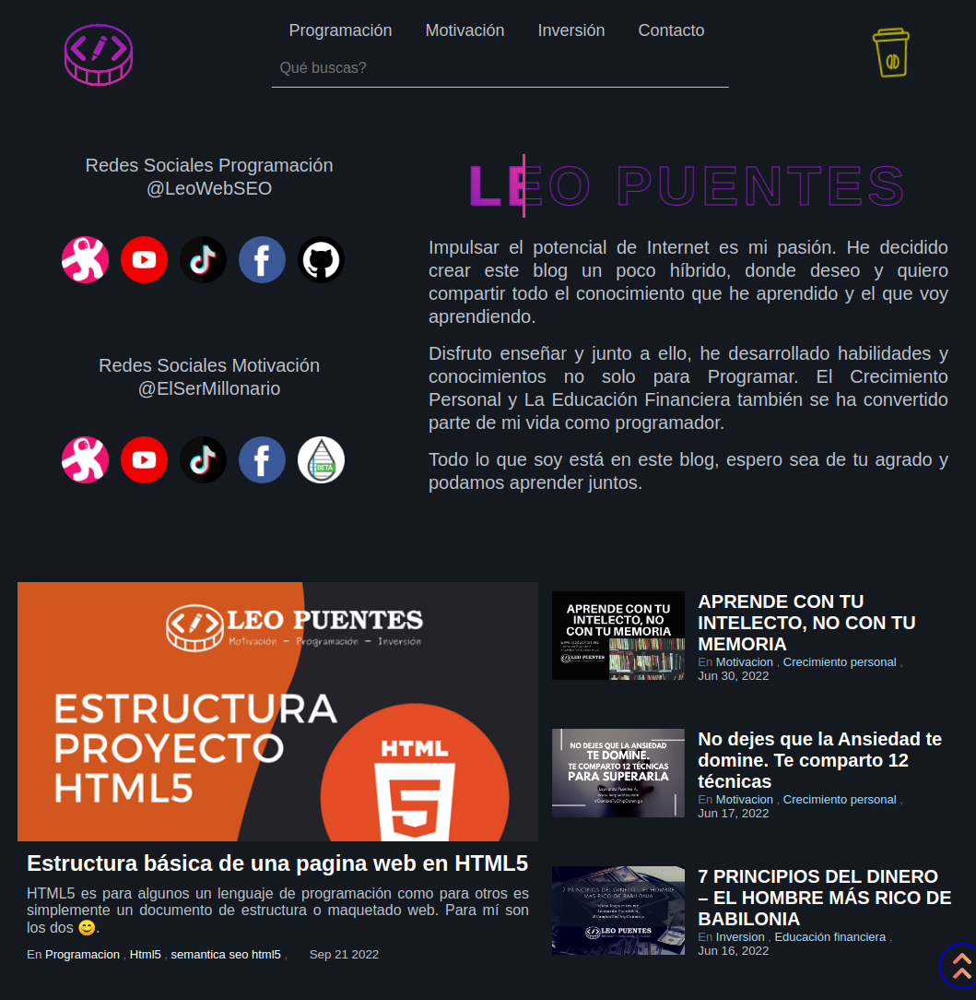

# Jekyll Plantilla Hooka v2.5.8 Alpha

Tema diseñado y desarrollado por [LeoWebSEO](https://leopuentes.me),



[Vista previa en funcionamiento](https://leopuentes.me)

## Requerimientos

- Ruby > 3.1.2
- Jekyll ~> 4.2.2

## Gestor de contenido - CMS HEADLESS FORESTRY

[](https://app.forestry.io/quick-start?repo=forestryio)


Este proyecto está preconfigurado para [Forestry](https://forestry.io) un CMS BASADO EN Git, [importelo desde la dashboard de Forestry](https://app.forestry.io/quick-start?repo=forestryio/) para editar y obtener una vista previa del sitio. ✨.

Para importarlo, debe de clonar toda la plantilla a su repositorio y porteriormente sincronizar el repositorio desde el CMS Forestry.

Cualquier cambio que realice al contenido en Forestry se vuelve a enviar al repositorio y se implementa automáticamente.

## Desarrollo Local

```bash
# clone your imported repository
# cd in the project directory
# install dependencies
bundle
# Start local dev server
bundle exec jekyll serve --livereload
# config sass to css
sass --wacth asset/sass/nom_style.sass:assets/css/nom_style.css
```

## Desarrollado y Creado con Jekyl + Forestry
## Características & Descripción

### Hooka V2.5.8 Alpha
- Optimizaciones seo:
    * Corrección redireccionamiento de categorías
    * Agregar ALT a imagenes y TITLE a enlaces
    * Anexo de descripción (120 a 155 caracteres), categoría y keywords en post
    * Acortador de títulos de post, se ajustó entre 45 a 65 caracteres
    * A categoría con más de dos palabras agregar guión (-) para unirlas
- Se eliminó etiquetas obsoletas o sin utilidad
    * Atributo ANY no válido el favicon
    * Barra inclinada "/" eliminada en etiquetas vacías
    * Etiquetas de caché obsoletas
- Optimizaciones de cargar
    * Se eliminó CSS innecesario
    * Ajuste de logos en dispositivos móviles

### Hooka V2.0.0 Alpha
- Aumento de la seguridad: Implemento [Secure Headers 6.5](https://github.com/github/secure_headers).
- Se ha especificado la url canonical y las url's alternativas, mejorando el SEO.
- Limitar resolucion en pantallas grandes a 1300px. Mejora visual en pantallas grandes.

### Hooka V1.0.10 Alpha
- Creación de Breadcrumbs en entradas de post
    * El codigo base es de https://jekyllcodex.org/without-plugin/breadcrumbs/#, las variaciones fueron pequeñas para adaptarlo en poder listar las categorías.
    * Para evitar inconvenientes; si el permalink tiene más de 1 nivel de profundidad, se debe de crear como categoría sin los guiones(-)
- Animación en icono de donación
- Input de búsqueda funcional
    * La búsqueda se realiza por medio de google pero sin salir del dominio configurado
- Barra de progreso de lectura para las páginas de contenido post
- Config. CDN Prism para dar Color a las etiquetas en el bloque de código (colores de consola)
- Configuracion de URL's canonical y alternativas

### Hooka V1.0.4 Alpha
- Url's configuradas para funcionar en IPFS
- Mejoras Visuales para dispositivos mobiles
    * Vista de post en una sola grilla
    * Tamaños de fuentes reducidas
    * Alineacion de titulos desfasados
- Post recomendados al final de cada post ajustados a una sola grilla
- Ajuste tamaño a imagenes de post 512 x 431 px

### Hooka V1.0.0 Alpha
- Mobile Responsive (Smartphone 480px/767px | Tablet: 768px/1023px | PC & Laptop: > 1024px)
- Sitemap y feed automático
- Atributos SEO para el index.html y entradas de blog
- Optimizado para motores de búsqueda
- Tema oscuro, no contiene tema claro
- Panel de Últimas entradas
- Sistema de compartido Open Graph data Facebook y Twitter Cards
- Input de búsqueda no funcional (fallo en el plugin)
- Cache con expiración de 90 días

## LICENCIA

[MIT](LICENSE)
